## A SMALL BOAT

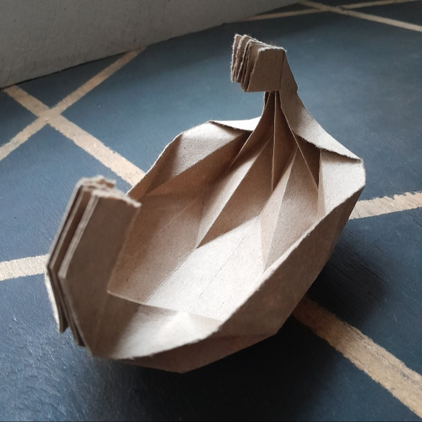

***
### ABOUT THE MODEL

I developed this model in June 2023. It is a simple one. I recommend using thick paper to allow wet-folding.

***

### STEPS

|                                                                                                                                                                            |                                                                                                                                                                  |
| :------------------------------------------------------------------------------------------------------------------------------------------------------------------------- | :--------------------------------------------------------------------------------------------------------------------------------------------------------------- |
|                                                                                            | Start with a rectangular sheet of paper.                                                                                                                         |
|                                                                                            | Make alternating mountain and valley folds.                                                                                                                      |
| 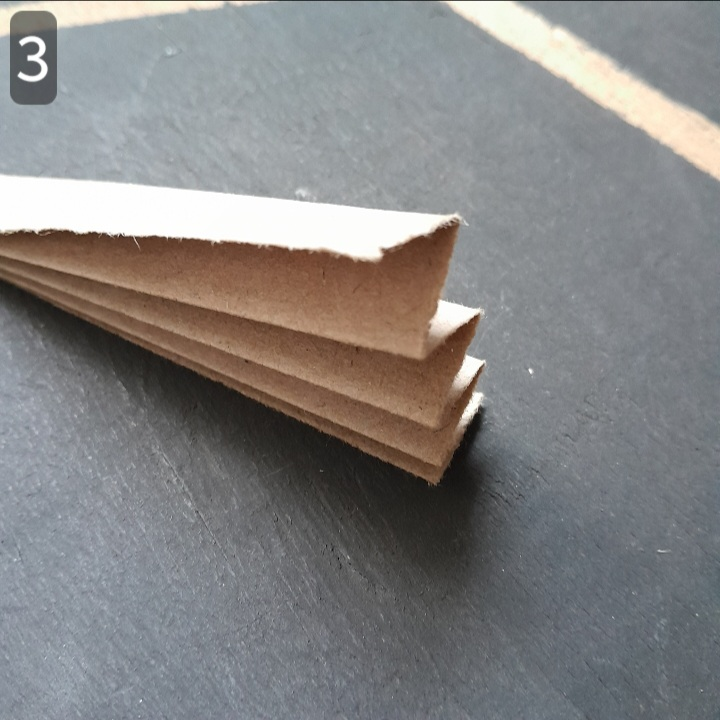                                                                                           | Fold into an accordion shape.                                                                                                                                    |
| 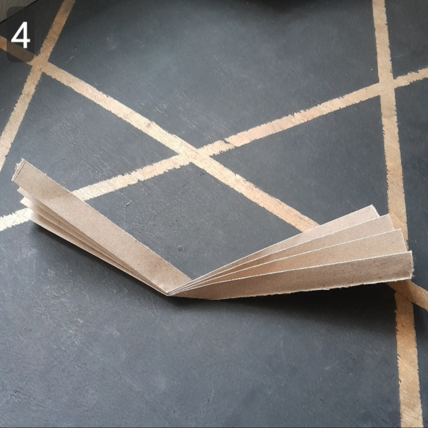                                                                                           | Get the center, unfold.                                                                                                                                          |
| 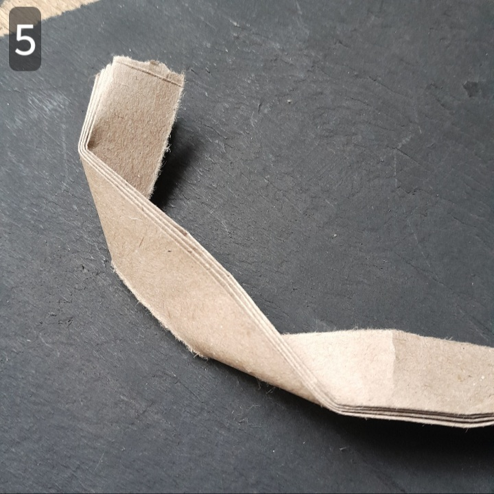                                                                                           | Towards one side (from the center) fold the model into a C shape.                                                                                                |
| 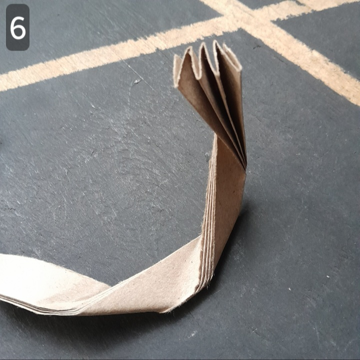                                                                                           | Repeat on the other side.                                                                                                                                        |
|                                                                                            | Unfold.                                                                                                                                                          |
| 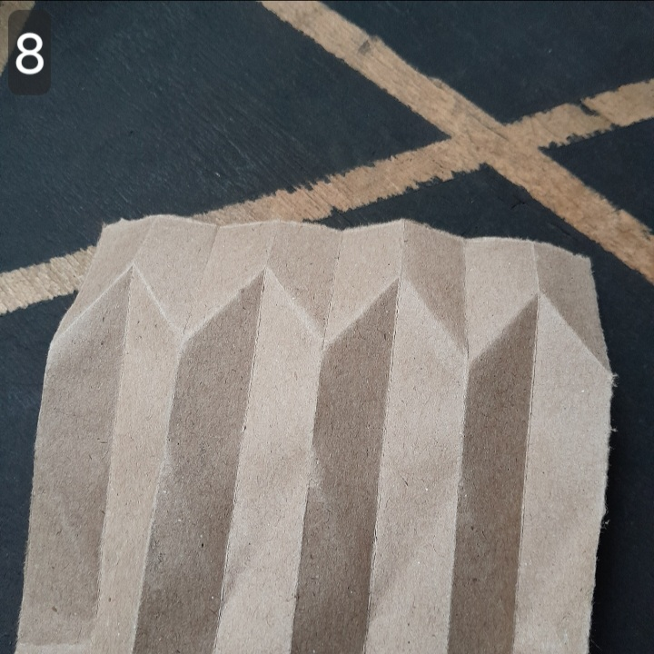  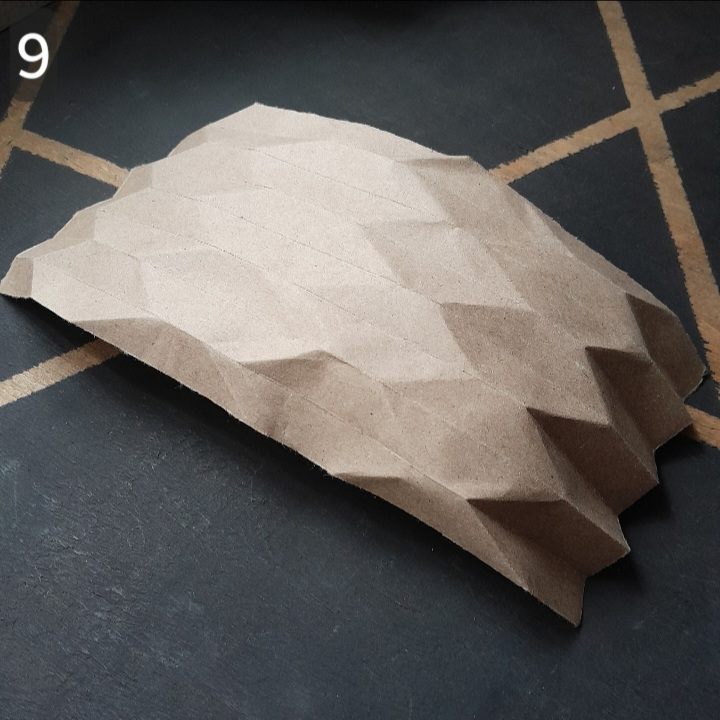         | Convert all the zigzags formed in step 5 and 6 into mountain folds. You'll notice that the boat is slowly taking shape. Continue reinforcing the mountain folds. |
| 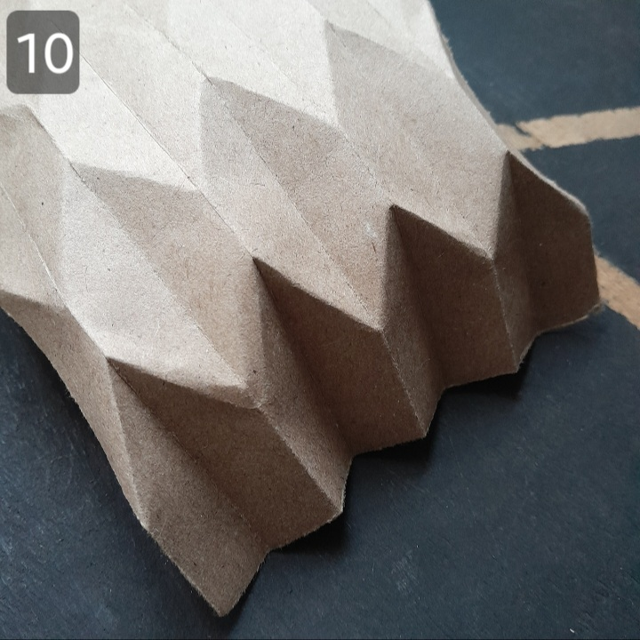 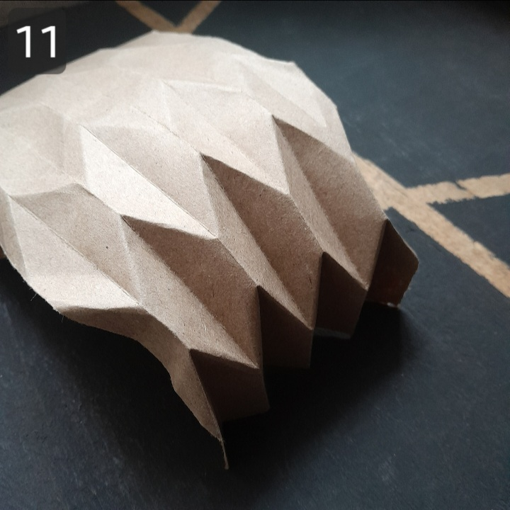      | Notice that once a mountain fold crosses a zigzag, it changes to a valley fold; and a valley fold becomes a mountain fold.                                       |
| 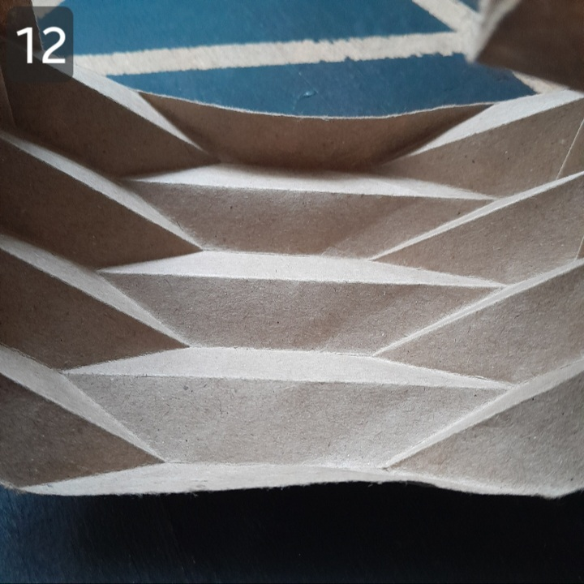 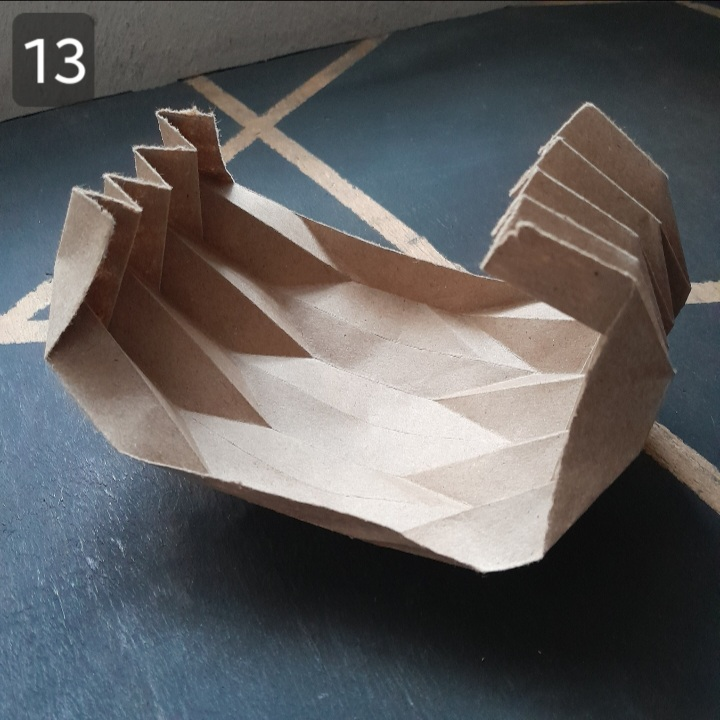      | Push the three central mountain folds downwards.                                                                                                                 |
| 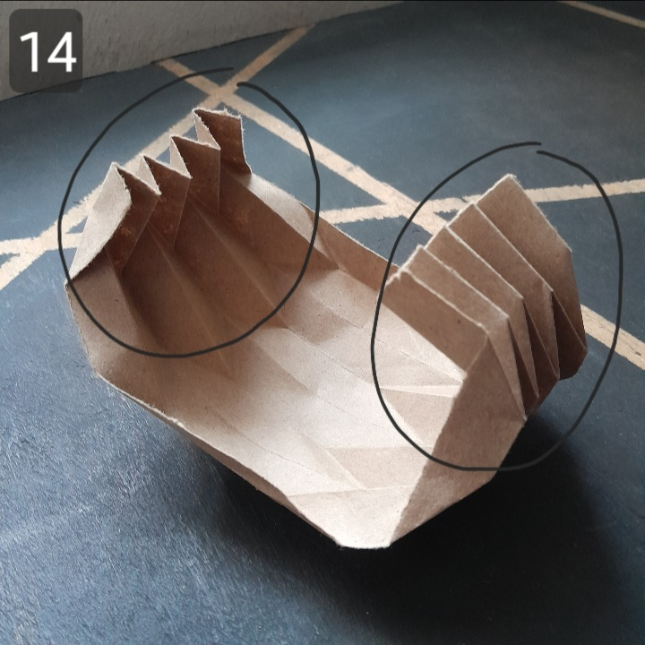  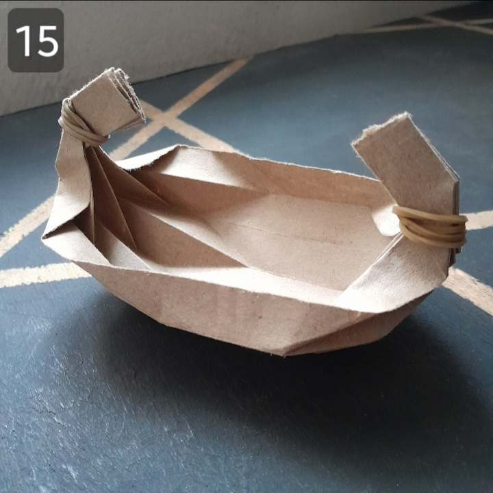 | Spray some water in the regions circled and tie with a rubber band/clip. Allow it to dry.                                                                        |
| 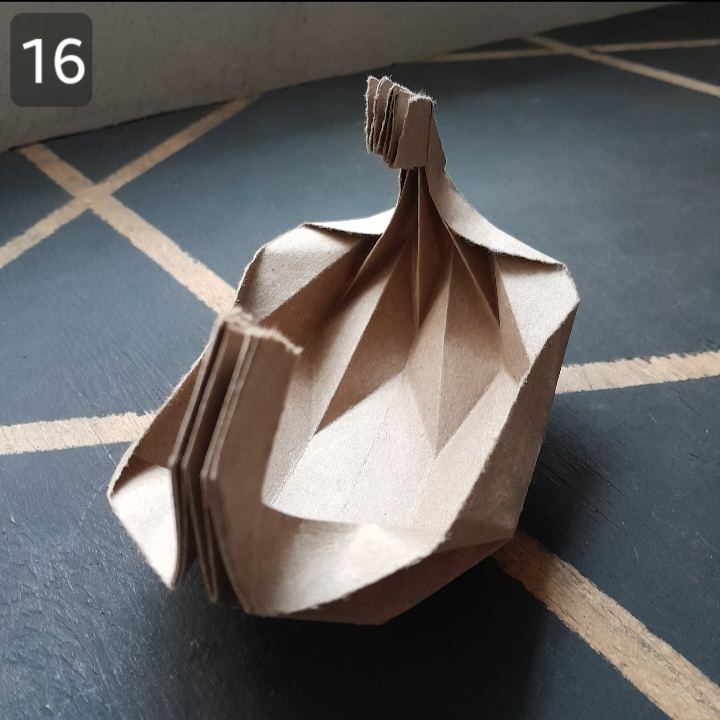                                                                                         | Done.                                                                                                                                                            |

***

### GALLERY

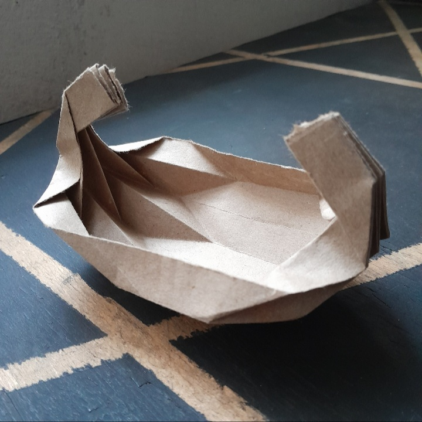

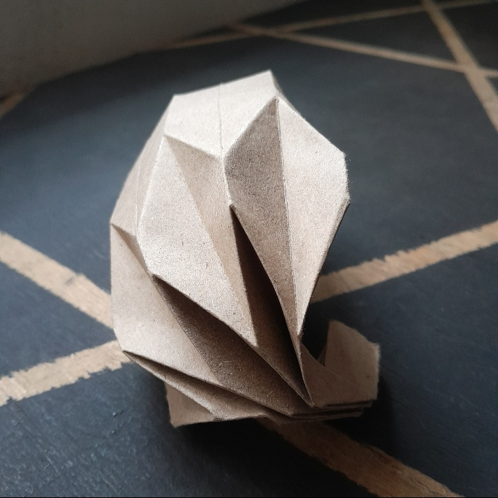

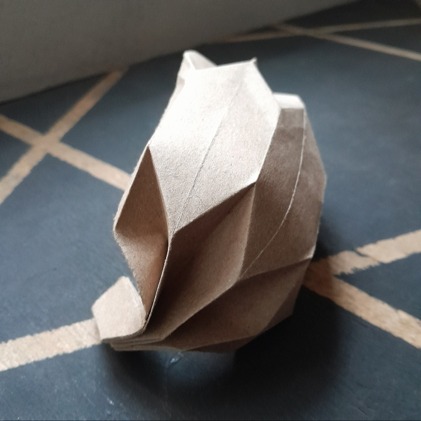

***
