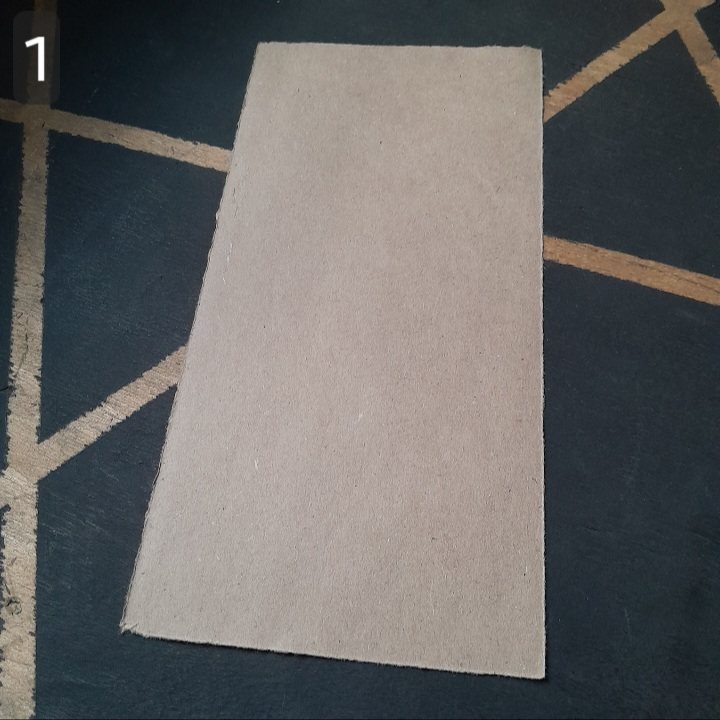
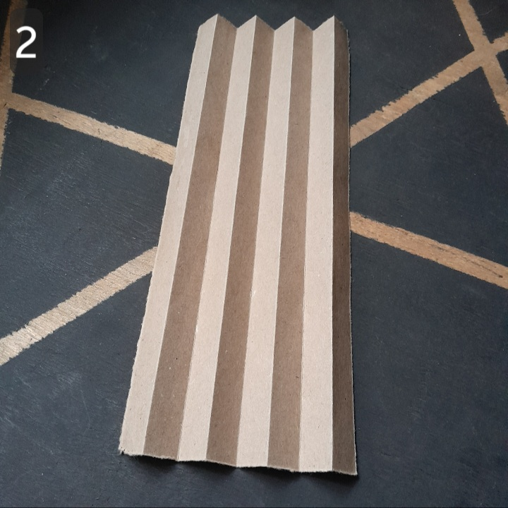

## A SMALL BOAT

### ABOUT THE MODEL

### STEPS

|                                                                                  |                                                        |
| :------------------------------------------------------------------------------- | :----------------------------------------------------- |
|  | Start with a rectangular sheet of paper.               |
|  | Fold alternating mountain and valley creases as shown. |

### GALLERY
