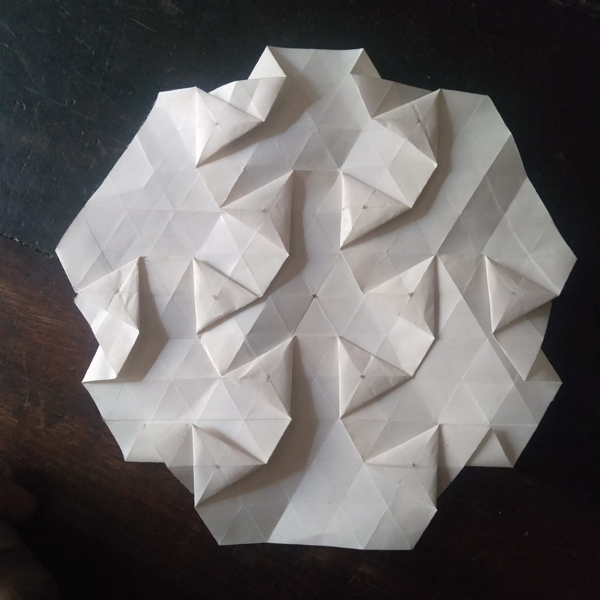

# ABOUT THE AUTHOR

Michael Muchai | email: foldcf@gmail.com | instagram: [@foldcf](https://www.instagram.com/foldcf?igsh=OHp5N3VmdXdzenA4) | Nakuru, Kenya

***

I fold paper.
I also teach, sometimes.

I used to fold origami when I was in primary and secondary school. I was not *that* serious. I mostly did the common models we taught each other — the boat, the plane, the frog etc. It was fun.

I remember one of my first 'independent discoveries': the space shuttle. Made it when I was in lower primary school, I can't remember exactly when. I made it by adding three paper guns to an inverted paper boat. Felt good.

While in high school, I started to look for instructions online, for example, "how to fold a paper crane, swan, elephant...", and then memorizing the steps. I didn't have a phone then, I used my dad's. Then I stumbled upon this origami fish that had scales (I can't remember the designer.) I was impressed and fascinated. I discovered tessellations within the next few weeks, but I didn't fold one until July 2020. Here is the first tessellation I ever folded:

To date, I have folded more than 100 tessellations, sold some and taught paper folding both locally and internationally. I think tessellations are cool. It's always fun to teach and fold them.

***
